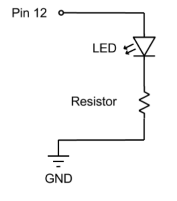

# Hello, Arduino!

## Resources

- Arduino on the web: <http://arduino.cc/>
- Software download: <http://arduino.cc/en/Main/Software>
- Language reference: <http://arduino.cc/en/Reference/HomePage>

## Books

- Getting Started with Arduino
- Arduino Cookbook
- Arduino Workshop (this book is fantastic!)

## What can you do with Arduino?

### Watertable

Lisa Steele and Kim Tomczak (tech: David McCallum)

<http://vimeo.com/41665706>

#### From the website:

> WATERTABLE highlights the area of the original Toronto waterfront just to the south of Fort York, thus illuminating the original shoreline of Lake Ontario. It was the area of the shoreline that was first spied by all those arriving at this place that would evolve into the city (first) York and (later) Toronto. It was this approach to the land from the water that many remarked upon in Toronto’s early historical writings, often pointing out the distinctive poplar and fir trees of the bay at this point of the early shoreline.

> This is the view that greeted generations of Aboriginal inhabitants who used the poplar and fir treed Humber Bay landing as the spot on which to disembark from their canoes and begin their journey to the gathering place near present-day Lake Simcoe. This is the area drawn by Elizabeth Simcoe, wife of the first Lieutenant Governor of Upper Canada and that presented itself to all of the early settlers and passers-through.

### Time Tunnel

Philippe Blanchard

<http://vimeo.com/28765364>

### HYBE

<http://www.youtube.com/watch?v=qhdG7OltXnU&feature=relmfu>

> Expandable Matrix of Transmissive Monochrome LCD (90x90mm), Custom designed Arduino compatible controller board, DMX512, SPI, Kinect /
IRIS is a unique media canvas with matrix of conventional information display technology - a monochrome LCD. Through the phased opening and closing of circular-segmented black Liquid Crystal, IRIS can create various patterns and control the amount (size) of passing lights. IRIS is an interactive medium for visual simplicity which uses the passage of ambient light, not emission of light itself.

> It is a selected and supported work of Da Vinci Idea Program(2012) by Seoul Art Space_Geumcheon, KOREA

### Flipbooks

Wendy Marvel and Mark Arnon Rosen

- [Horse in Motion](http://vimeo.com/48901714)
- [Ascension](http://vimeo.com/48901717)
- [Spilling Water](http://vimeo.com/48901716)

Sequences from Eadweard Muybridge

### Playa

Rubén d’Hers

<https://vimeo.com/50200793>

### Aurora Dress

CuteCircuit

<https://vimeo.com/43979170>

## Let’s read an Arduino sketch

You can get the following sketch from inside the Arduino program. You’ll find it under `File > Examples > 01.Basics > Blink`.

    /*
     Blink
     Turns on an LED on for one second, then off for one second, repeatedly.
     This example code is in the public domain.
    */
    // Pin 13 has an LED connected on most Arduino boards.
    // give it a name:
    int led = 13;

    // the setup routine runs once when you press reset:
    void setup() {
      // initialize the digital pin as an output.
      pinMode(led, OUTPUT);
    }

    // the loop routine runs over and over again forever:
    void loop() {
      digitalWrite(led, HIGH);   // turn the LED on (HIGH is the voltage level)
      delay(1000);               // wait for a second
      digitalWrite(led, LOW);    // turn the LED off by making the voltage LOW
      delay(1000);               // wait for a second
    }

### Comments

- “Block” comments - anything between `/*` and `*/` is ignored by the computer.
- You can also comment something by preceding it with `//`, like “`// turn the LED on`” in `loop()`.

### Declaring variables

Before the program runs, give it some information. Here, we’re telling it we’re going to use a variable called led. It’s an integer and we’re setting it to 13. So anytime we refer to led later in the sketch, the Arduino uses the number 13. For instance, in `loop()`, when the Arduino gets to:

    digitalWrite(led, HIGH);

the Arduino will replace led with 13, so it’ll execute:

    digitalWrite(13, HIGH);

In this case, we’re doing this for convenience: If we later decide we want to flash pin 12, we can just change the variable declaration instead of finding all the references to pin 13 in the sketch.

Once you’ve declared a variable, it’s easy to change it. So you could create an integer variable called ledState and set it initally to off:

    int ledState=0;

then later in the program, change its value:

    ledState=1;

but that comes later.

### `void setup()`

- Runs once at the beginning of your program
- This is where you can make some initial settings
- In this case, we’re telling Arduino that we’re going to use pin 13 for output.

### `void loop()`

Runs over and over, after setup(). This is the meat of your program. In this case, it loops 4 instructions:

1. Turn the LED on
2. Wait 1 second
3. Turn the LED off
4. Wait 1 second

### Put it on a breadboard

Move the project onto a breadboard. This time, connect the LED to pin 12. You need to do 2 things:

1. Edit the sketch (what do you need to edit?)
2. Add a resistor to the circuit (150Ω or 220Ω is good):

### More than one LED

- How can you flash a bunch of LEDs at once?
- How can you create a sequence of flashing LEDs?

## Let’s get analog

### Analog output

**Digital vs. analog:** Digital has only two states: on and off (or 1 and 0). “Analog” (we’re not really doing analog here, but we don’t care right now) allows us to deal with a range of values. In Arduino’s case, that range is between 0 and 255 for output and 10 and 1023 for input.

`analogWrite()` works the same way as `digitalWrite()`, but with that range. Switch a resistor/LED pair to any output pin marked with a “~” on the board, and edit your sketch to include something like:

    analogWrite(led, 100);

Change the number to something else between 0 and 255. What happens?

#### Changing analog values over time: for()

Try putting this inside your loop() function:

    for ( int brightness = 0; brightness < 256; brightness++ ) {
      analogWrite(led, brightness);
      delay(5);
    }

for() has 3 parts:

1. `int brightness = 0`: create an integer variable called brightness, and set it to 0
2. `brightness < 256`: as long as brightness is less than 256, do whatever is inside the loop (between { and })
3. `brightness++`: at the end of each repetition, add 1 to brightness (`++` is shorthand for add 1)

### Analog input

You can use `analogRead()` to check the voltage (between 0 and 5V) on any of the 6 Analog in pins - you’ll get a number between 0 and 1023.

To make the physical connections, you need a device with 3 connectors on it—you can use a potentiometer, or pot, which is like a volume knob. Connect the outer pins to GND and 5V respectively, and the middle to one of the Analog inputs.

Read an analog pin just like you’d write, but using `analogRead()`:

    // create a variable called “reading” and put the value on analog pin 0 into it:
    int reading = analogRead(0);

You can watch the numbers you’re reading by using the serial connection to the computer. To do this, you need to add two things to your sketch:

In `setup()`, initialize serial communication (turn it on):

    Serial.begin(9600);

then, after you’ve read from the analog pin:

    Serial.println(reading);

When you open the serial monitor (magnifying glass, top right of the sketch window), you’ll see a window with a really fast stream of numbers.

How do you scale these numbers (0-1023) to a range we can use for analog output (0-255)?

## Voltage dividers

Clearly, light sensitive resistors, pressure sensors, bend sensors, and so on are way cooler than knobs. The problem is, they only have two pins, and we need 3.

The long answer is that the knob is what’s known as a variable resistor, or potentiometer. We’re using it as a voltage divider - basically, we’re making it into 2 resistors, and reading the voltage at the midpoint between them. If both resistors are the same (the knob is in the middle), the voltage will be half the supply (1/2 of 5V = 2.5 V) and the pin will read around 512 (half of 1024) one resistor is small and the other large (the knob’s more to one side than the other), the voltage and reading will change accordingly.

The point is that the Arduino doesn’t care exactly what the values are of the two resistors - it just cares about the ratio between their values. All we have to do is “invent” a third pin by adding a resistor to the circuit. Connect one end of the sensor to 5V and the other to your analog input pin (that’s R1 in the diagram above). Then connect a resistor (10k is a good starting point) between that same input pin and GND (R2).